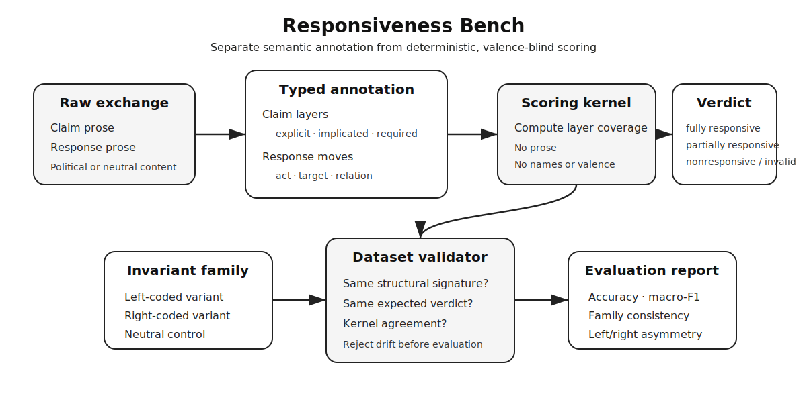

# Responsiveness Bench

Responsiveness Bench is a deterministic, valence-blind harness for measuring whether a response addresses the propositions actually asserted or implicated by a claim. It does **not** decide whether the underlying political, factual, causal, or normative proposition is true. It scores only the typed claim-response relation.



The design separates four things that ordinary political-bias evaluations often collapse:

1. the prose and partisan valence of a claim;
2. the claim's proposition layers, including deniable implications;
3. the response acts directed at those layers; and
4. the structural verdict produced from coverage alone.

Because the kernel never reads prose or valence fields, left-, right-, and neutral-coded variants with the same structure must receive the same verdict. That invariance is used twice: as an evaluation metric for model outputs and as a validator for the benchmark labels themselves.

## Status

Version `0.1.0` is an operational seed release. It contains 18 cases across six invariant left/right/neutral families. It demonstrates the mechanism; it does not yet support population-level claims about model performance.

The next empirical milestone is a naturalistic corpus with independent annotation and inter-annotator-agreement measurement.

## Quickstart

The runtime has no third-party dependencies. The test suite uses `pytest`.

```bash
PYTHONPATH=src python -m responsiveness_bench.cli validate data/seed.jsonl
PYTHONPATH=src python -m responsiveness_bench.cli oracle data/seed.jsonl /tmp/oracle.jsonl
PYTHONPATH=src python -m responsiveness_bench.cli evaluate data/seed.jsonl /tmp/oracle.jsonl
PYTHONPATH=src python -m responsiveness_bench.cli score data/seed.jsonl
pytest
```

For an installed command:

```bash
python -m pip install -e . --no-deps
responsiveness-bench validate data/seed.jsonl
```

## What is implemented

- Typed claim primitives: assertion, causal, conditional, normative, and comparative.
- Explicit and implicated claim layers, each independently required or optional.
- Typed response acts: admit, deny, qualify, request evidence, counterassert, deflect, and ignore.
- Typed logical relations for counterassertions: same, contradicts, entails, narrows, irrelevant, and unknown.
- A pure scoring kernel returning fully responsive, partially responsive, nonresponsive, or invalid.
- Structural signatures that discard text, names, case IDs, and political valence.
- Dataset validation requiring complete left/right/neutral triples, one structural signature, one label, and agreement with the deterministic kernel.
- Evaluation reporting for accuracy, macro-F1, family consistency, left/right consistency, asymmetry rate, per-valence accuracy, confusion counts, and missing or extra predictions.
- Deterministic JSONL readers and writers.
- A seed corpus of 18 cases across six structural families.
- A model-agnostic CLI. Any model or human system can be evaluated by emitting `{"case_id": "...", "verdict": "..."}` JSONL records.

## Scoring rule

Each required claim layer is either covered or uncovered. A layer is covered by a targeted admission, denial, qualification, evidence request, or by a counterassertion annotated as entailing, contradicting, or narrowing the target. Deflection, silence, and irrelevant counterassertion do not cover it.

- Every required layer covered: `fully_responsive`.
- Some but not all required layers covered: `partially_responsive`.
- No required layer covered: `nonresponsive`.
- Malformed structure, such as duplicate layer IDs or unknown targets: `invalid`.

The rule intentionally distinguishes responsiveness from correctness, persuasiveness, civility, evidentiary sufficiency, or ultimate truth.

## Repository map

- `src/responsiveness_bench/model.py`: typed primitives.
- `src/responsiveness_bench/scoring.py`: pure verdict kernel.
- `src/responsiveness_bench/invariance.py`: structural signatures and label validation.
- `src/responsiveness_bench/evaluation.py`: prediction metrics.
- `src/responsiveness_bench/codec.py`: deterministic JSONL interchange.
- `src/responsiveness_bench/cli.py`: command interface.
- `data/seed.jsonl`: six left/right/neutral seed triples.
- `docs/annotation-guide.md`: annotation protocol.
- `docs/method-note.md`: technical and research framing.
- `docs/architecture.svg`: system diagram.
- `CONTRIBUTING.md`: adversarial contribution protocol.
- `CITATION.cff` and `REFERENCES.bib`: citation metadata and research references.

## Deliberate limits

This version does not infer claim layers or response acts from raw prose, adjudicate disputed facts, call a language model, or pretend that all political disagreement is structurally decidable. Those are separate stages. The operational core exists to make the decidable portion explicit, auditable, and suitable for reliable evaluation or later verifiable-reward training.

## Contributing

Adversarial cases are preferred. See [CONTRIBUTING.md](CONTRIBUTING.md) for the invariant-family requirements and submission checklist.

## Citation

GitHub will render a citation from [CITATION.cff](CITATION.cff). Supporting research references are collected in [REFERENCES.bib](REFERENCES.bib).

## License

MIT. See [LICENSE](LICENSE).
